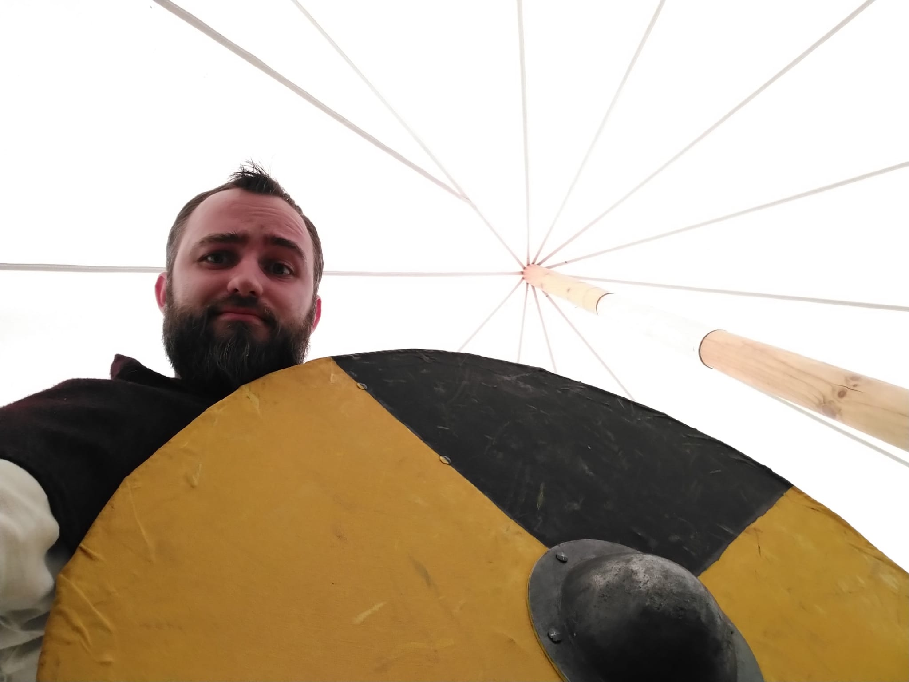

> Byliśmy z Danielem na Wiankach na Owidzu. Impreza ta była naprawdę zacna. Od początku przywiała nas gościnność drużyny Nordelag, której zawdzięczamy wspaniałą biesiadę wraz z pysznym piwem uwarzonym specjalnie na ich XX lecie założenia.

Od całej naszej drużyny złożyłem najserdeczniejsze życzenia wszelkiej pomyślności kierownictwu ww drużyny oraz wyraziłem szczerą chęć współpracy w naszych reko przedsięwzięciach. Mieliśmy możliwość uczestniczenia w oprowadzaniu po grodzisku, śpiewaniu pieśni z okazji nocy kupały, uczestniczenia w obrzędach oraz (gdybyśmy mieli sprzęt i umiejętności) walki 1v1, 5v5 oraz walnej inscenizacji wraz z bitwą.

<strong>Nordelag</strong> to całkiem czysty lager z dodatkiem jałowca uwarzony przez browar <strong>Czarna Owca</strong>. Przyjemne nuty jałowcowe na niskim poziomie nadawały charakter temu piwu, przy czym dodatek (co jest zaletą tego piwa) nie dominował całości, dzięki czemu konsumpcja okazała się nadzwyczaj przyjemna.

| | |
| ----------- | ----------- |
|  |  |
|  |  |

Daniel udzielał się szczególnie w warsztatach tańca zorganizowanych przez białoruski zespół Jawaryna. Standardowo wspaniałą gościnnością wykazali się nasi przyjaciele z Niflheim, którzy wybornie ugościli nas pod swoją wiatą w sobotnim skwarze. Udało się nam dzięki temu wzmocnić nasze relacje i pogłębić współpracę, która mamy nadzieję będzie owocna już w tym sezonie.

| | |
| ----------- | ----------- |
|  |  |

Podsumowując pierwszy drużynowy wyjazd na imprezę od 2019r. (jeśli się mylę proszę mnie poprawić) muszę powiedzieć, że wzmogła ona chęć i tchnęła nowego ducha drodze ku kolejnym wyjazdom i wspólnej przygodzie związanej z Drużyną księcia Sambora